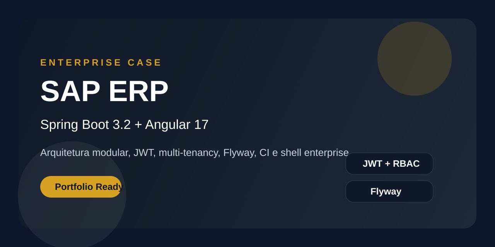

# SAP ERP Enterprise Case

[](./backend)
[](./frontend)
[](./backend/pom.xml)
[](./LICENSE)

Sistema ERP full stack inspirado em cenarios enterprise, construido para demonstrar arquitetura modular, autenticacao JWT, multi-tenancy, integracoes e operacao local com Docker.



## Visao Geral

Este repositorio foi reposicionado para apresentar um unico produto principal:

- `backend/`: API enterprise com Spring Boot, Spring Security, JPA, Redis, RabbitMQ e OpenAPI
- `frontend/`: SPA Angular com autenticacao, dashboard, modulos ERP e navegacao protegida
- `k8s/`: manifests iniciais para empacotamento e deploy
- `docs/`: arquitetura, roadmap e backlog tecnico


## Stack

### Backend

- Java 21
- Spring Boot 3.2
- Spring Security + JWT
- Spring Data JPA
- Flyway
- PostgreSQL
- Redis
- RabbitMQ
- OpenAPI / Swagger

### Frontend

- Angular 17 com standalone components
- TypeScript
- SCSS
- HttpClient com interceptor de autenticacao

### Operacao

- Docker Compose
- Kubernetes manifests
- GitHub Actions CI

## Destaques Tecnicos

- Arquitetura modular por dominio (`base`, `fi`, `co`, `mm`, `sd`, `wm`, `hcm`)
- Multi-tenant com contexto de tenant por usuario autenticado
- Autenticacao stateless com JWT
- Auditoria por AOP com anotacao `@Auditable`
- Observabilidade inicial com Actuator e endpoint Prometheus
- Cache Redis e mensageria RabbitMQ preparados para evolucao
- Documentacao OpenAPI gerada automaticamente
- Fundacao de migrations versionadas com Flyway
- Schema inicial de `base` e `fi` versionado via Flyway
- Contratos mais consistentes com DTOs e mapeamento dedicado no backend
- Shell Angular enterprise com navegacao lateral reutilizavel

## Executar em 5 Minutos

### 1. Configurar variaveis

Copie `.env.example` para `.env` e ajuste os valores necessarios.

### 2. Subir dependencias

```bash
docker-compose up -d postgres redis rabbitmq
```

### 3. Rodar backend

```bash
cd backend
mvn spring-boot:run
```

### 4. Rodar frontend

```bash
cd frontend
npm install
npm start
```

### 5. Acessar

- Frontend: `http://localhost:4200`
- API: `http://localhost:8080/api`
- Swagger UI: `http://localhost:8080/api/swagger-ui.html`
- RabbitMQ: `http://localhost:15672`

### Credenciais demo

- Email: `admin@demo.com`
- Senha: `admin123`

Disponiveis automaticamente no profile `dev`.

## Execucao com Docker Compose

```bash
docker-compose up -d
docker-compose logs -f
docker-compose down
```

## Estrutura

```text
.
|-- backend/
|   |-- src/main/java/br/com/sap/erp/
|   |   |-- core/
|   |   `-- modules/
|   `-- src/main/resources/
|-- frontend/
|   `-- src/app/
|-- docs/
|-- k8s/
`-- docker-compose.yml
```

## Qualidade e Portfolio

Este projeto esta sendo evoluido como case enterprise com foco em:

- arquitetura limpa e modular
- organizacao profissional do repositorio
- documentacao clara para recrutadores e avaliadores tecnicos
- pipeline CI
- seguranca e configuracao por ambiente
- UX mais forte no dashboard e login

## Roadmap

- Fase 1: limpeza do repositorio e posicionamento de portfolio
- Fase 2: endurecimento tecnico do backend e do frontend
- Fase 3: amadurecimento visual, testes e demonstracoes

Detalhamento em [docs/ARCHITECTURE.md](./docs/ARCHITECTURE.md), [docs/ROADMAP.md](./docs/ROADMAP.md) e [docs/BACKLOG.md](./docs/BACKLOG.md).
Guia de demonstracao em [docs/DEMO_GUIDE.md](./docs/DEMO_GUIDE.md).

## Testes

```bash
cd backend
mvn test
```

```bash
cd frontend
npm install
npm run build
```

## GitHub e Apresentacao

Para um repositorio de portfolio forte, a recomendacao e manter:

- branch principal limpa
- README atualizado com stack e evidencias
- screenshots e GIFs em `docs/`
- PRs pequenas e descritivas
- CI verde antes de publicar como case principal

## Autor

Daniel Barbieri  
Software Engineer | Full Stack Developer

- GitHub: [DanielBarbieri21](https://github.com/DanielBarbieri21)
- LinkedIn: [daniel-barbieri-4990462a](https://www.linkedin.com/in/daniel-barbieri-4990462a/)
